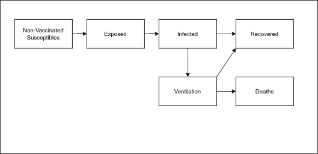
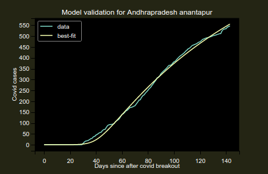

<!-- ALL-CONTRIBUTORS-BADGE:START - Do not remove or modify this section -->

<!-- ALL-CONTRIBUTORS-BADGE:END -->

# project-manna
Submitted at InOut 2020. This project has been deployed on heroku, and can be accessed from this link. [project-manna](https://project-manna.herokuapp.com/)

## Motivation
Vaccine for Covid-19 has been developed in record time. Now, the next big challenge is a logistical one, manufacturing vaccine at scale and mass innoculation. It will be some time before everyone is vaccinated. So we need to make the best out of the limited supply we will be getting initially. By predicting vunerable demographics beforehand, we can vaccinate these people on a priority basis to decrease fatality rate.

## How our model works
We have collected the data from covid19india.org, who are doing an awesome job at crowdsourcing the data!

## Model USP
Normally SIR models are made to model infection-spread of a disease. While Project Manna has been improved to support vaccinationation scenario by considering that vaccinated people can't spread or get affected by covid.

Here follows a simple block view of the compartments of the enhanced SIR model.

## Model Validation
We tried comparing graphs for a particular district, by comparing graph fitted by the model and the real data graph for covid cases.

## Terminology
* Risk in a district= Predictied new cases after 15 days
*

## Tech stack

   
  
  
  
  
  
  
  
    

## Features
- [x] General statistics- Active | Confirmed | Recovered cases
- [x] District wise risk estimation
- [x] District wise vaccination urgency estimation
- [x] Risk visualization in different population region (high or low)
- [x] Decision making on distribution of available vaccinations amongst districts (i.e. how many vaccines to deliver to which district in case a limited supply of vaccines)

## Credits
* The SIR model we devised was inspired from this project [infectious_disease_modelling](https://github.com/henrifroese/infectious_disease_modelling)
* We have used the star admin react template for our dashboard.
* We used the following d3.js template to draw the map of India. [choropleth map of India](https://bl.ocks.org/anilnairxyz/11190f144a89b54c6698699f3a83b315)

## Starware

DesignrKnight/Loud-N-Cloud is Starware.  
This means you're free to use the project, as long as you star its GitHub repository.  
Your appreciation makes us grow and glow up. ⭐

## Contributors ✨

Thanks goes to these wonderful people ([emoji key](https://allcontributors.org/docs/en/emoji-key)):

<!-- ALL-CONTRIBUTORS-LIST:START - Do not remove or modify this section -->
<!-- prettier-ignore-start -->
<!-- markdownlint-disable -->
<table>
  <tr>
    <td align="center"><a href="https://github.com/DesignrKnight"> <b>Abel Mathew</b></a> <a href="https://github.com/DesignrKnight/Loud-N-Cloud/commits?author=DesignrKnight" title="Code">💻</a></td>
    <td align="center"><a href="https://github.com/roshankshaw"> <b>Roshan Kumar Shaw</b></a> <a href="https://github.com/DesignrKnight/Loud-N-Cloud/commits?author=roshankshaw" title="Code">💻</a> <a href="#design-roshankshaw" title="Design">🎨</a></td>
    <td align="center"><a href="http://harshsri2208.github.io"> <b>Harsh Srivastava</b></a> <a href="https://github.com/DesignrKnight/Loud-N-Cloud/commits?author=harshsri2208" title="Code">💻</a> <a href="#design-harshsri2208" title="Design">🎨</a></td>
    <td align="center"><a href="https://sayan1999.github.io/"> <b>Sayan Dey</b></a> <a href="https://github.com/DesignrKnight/Loud-N-Cloud/commits?author=sayan1999" title="Code">💻</a></td>
    <td align="center"><a href="https://github.com/Chinmay-KB"> <b>Chinmay Kabi</b></a> <a href="https://github.com/DesignrKnight/Loud-N-Cloud/commits?author=Chinmay-KB" title="Code">💻</a> <a href="#content-Chinmay-KB" title="Content">🖋</a></td>
  </tr>
</table>

<!-- markdownlint-enable -->
<!-- prettier-ignore-end -->
<!-- ALL-CONTRIBUTORS-LIST:END -->

This project follows the [all-contributors](https://github.com/all-contributors/all-contributors) specification. Contributions of any kind welcome!
